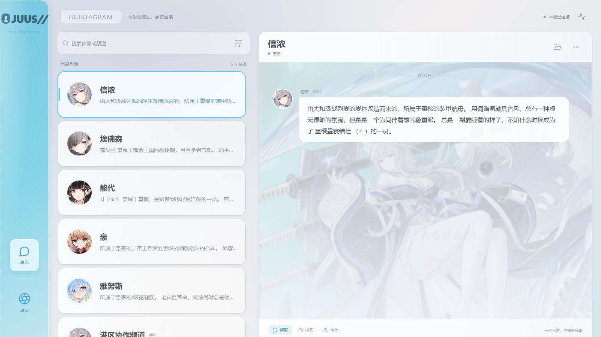
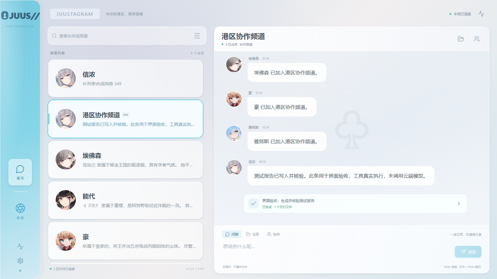
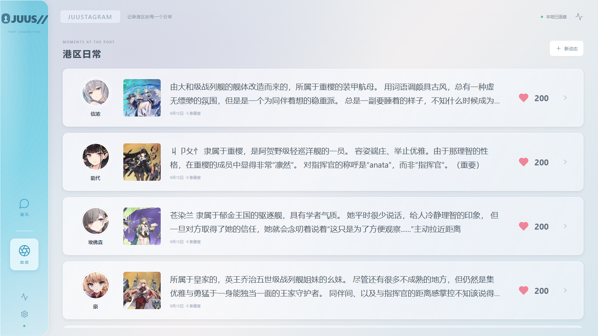
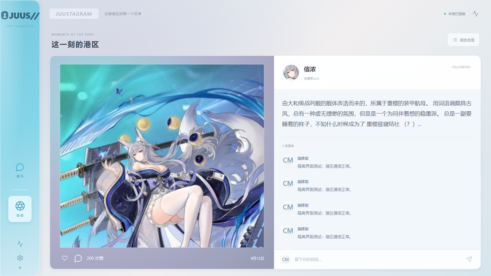
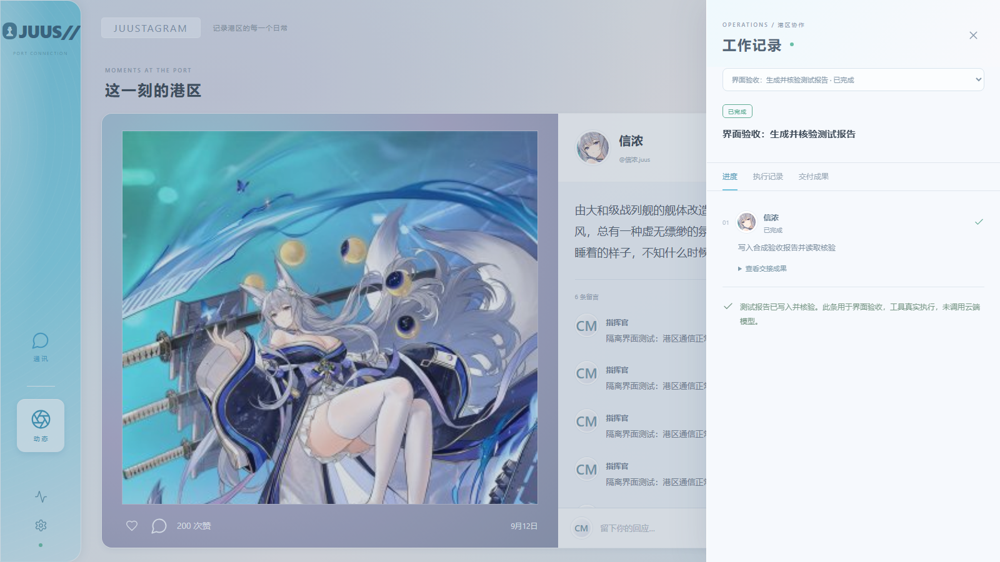
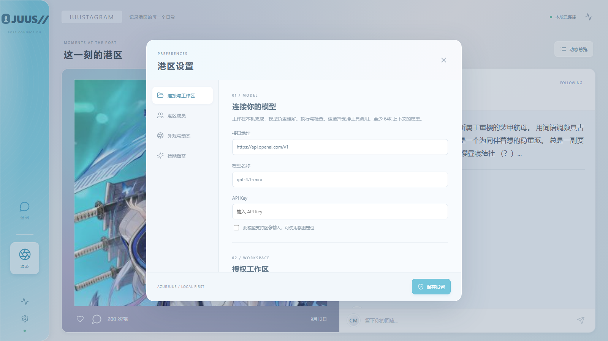
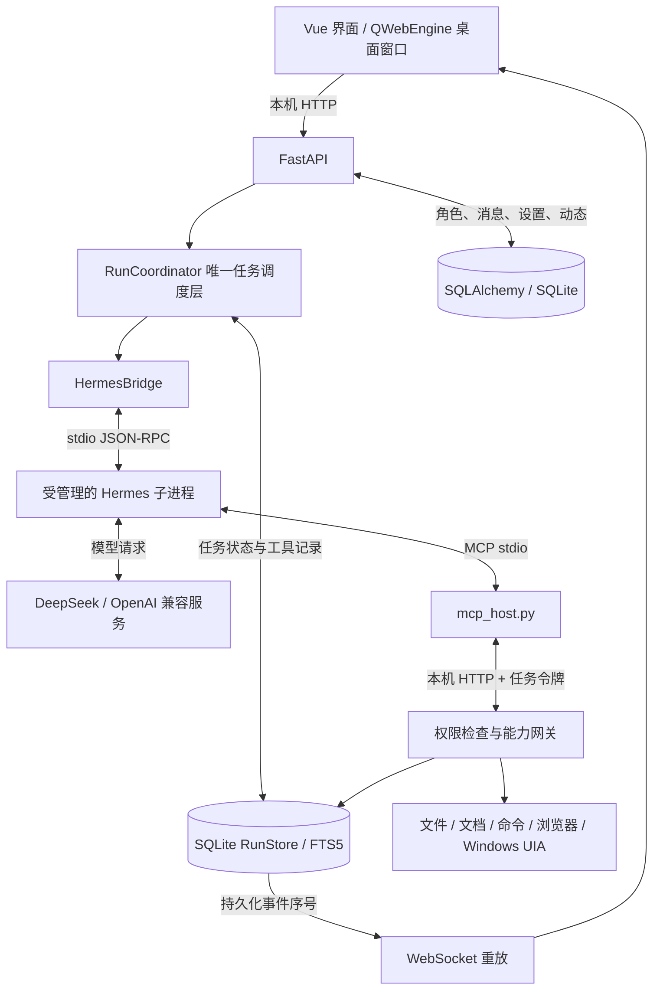

<div align="center">

# AzurJuus · 港区通讯

**一个让「舰娘」真的会干活的本地 Agent 桌面应用**




</div>

---

## 一句话

当前实现说明：先读 [技术报告](docs/TECHNICAL_REPORT.md)，再读 [代码调用链](docs/CODE_WALKTHROUGH.md)；面试准备见 [项目讲解](docs/INTERVIEW_GUIDE.md)，目录与 Docker 取舍见 [项目组成](docs/PROJECT_COMPONENTS.md)。

2026-09-16：新增人物经历、关系与技能试用机制，使用及技术细节见 [人物认知与成长说明](docs/COGNITION_GUIDE.md)。人格自然度的人工对照尚未验收，不能用功能测试替代。

你对着港区说：「把这三份资料汇总成一份报告。」

信浓接单、能代复核、报告真的出现在磁盘上——而不是聊天框里冒出一句「✅ 已完成」。

AzurJuus 把 **角色化通讯界面**（JUUS 私聊 / 群聊 / 朋友圈）和 **真的会动本机文件的 Agent 执行链** 缝在了一起。它的技术立场只有一条：

> **模型的自信心不是验收标准。**

---

## 目录

- [它是什么，它不是什么](#它是什么它不是什么)
- [核心设计：完成权不在模型手里](#核心设计完成权不在模型手里)
- [一条任务的完整旅程](#一条任务的完整旅程)
- [功能一览](#功能一览)
- [界面](#界面)
- [架构](#架构)
- [快速开始](#快速开始)
- [配置与使用](#配置与使用)
- [项目结构](#项目结构)
- [验证](#验证)
- [诚实的边界](#诚实的边界)
- [文档索引](#文档索引)
- [数据来源与版权](#数据来源与版权)

---

## 它是什么，它不是什么

**它是什么**

一个跑在你自己 Windows 机器上的 Agent 桌面应用。界面是港区通讯录，聊天对象是《碧蓝航线》的角色；但点下「任务」或「协作」之后，她们会真的读写文件、跑命令、读 PDF/DOCX/XLSX、操作浏览器，甚至整理 Windows 文件资源管理器。

**它不是什么**（这些误解最好一开始就掐掉）

| 误解 | 事实 |
| --- | --- |
| 「每个舰娘是一个单独训练的模型」 | 不是。她们共用同一个基础模型（如 DeepSeek），靠**人设 + 阶段工具权限 + 上下文隔离**区分。项目没有训练任何权重。 |
| 「完全离线」 | 程序、工具执行和默认数据都在本机，但模型调用会发往你配置的服务（云端或本地兼容接口）。用云端时，提示、历史和工具返回都会外发。 |
| 「一个操作系统级沙箱」 | 不是。这是一层**应用权限控制**。获批的命令拥有你当前用户的完整权限，工作目录不限制它访问别处。 |
| 「舰娘会自己变聪明」 | 「成长」是外部经历、关系判断和方法更新，不是权重更新。目录清单与文件分类候选可在三个隔离场景验证后启用，其他任务族仍保留候选。 |

---

## 核心设计：完成权不在模型手里

这是整个项目最值得看的地方，也是它和「套壳聊天 + function calling」最大的区别。

早期版本的失败长这样：成员回一句「我已经把文件整理好了」，系统就把任务标记为完成。结果磁盘上什么都没有——**看起来在工作，实际没有交付**。

现在的规则是：**成员无权宣告完成，只有调度层可以。**

一个成员想交付，必须提交结构化的 `deliver`，而系统会逐条核对：

| 检查项 | 说明 |
| --- | --- |
| 调用归属 | 引用的 `callId` 必须真实存在、成功结束、属于**同一个任务和当前阶段** |
| 证据不可自证 | `deliver`、`delegate`、查历史本身**不能**充当核验证据 |
| 产物真实存在 | 每个 artifact 必须真的躺在授权工作目录里 |
| 哈希一致 | 成员读过这个文件，且读取时记录的 SHA256 与**当前文件**相同 |
| 不许跳过 | 待审批、结果未知的调用不能被忽略 |
| 失败要交代 | 失败/被拒的操作必须写明修正方案并引用后续成功核验，或明确列入未解决项 |

然后由**单独开一个只读审查阶段**重新读一遍产物、引用自己的核验调用。审查发现问题时最多自动修订两轮，仍不过就暂停——而不是假装成功。

> 哈希只能证明「被检查的就是这份内容，且检查时没变」，它**不能**证明报告的结论正确。语义正确性靠任务验收和独立审查。这条边界我们写在文档里，也不打算含糊过去。

同样的克制贯穿全局：

- **权限不写在提示词里**，写在工具网关里。路径先解析真实目标再校验是否越界，符号链接和 Windows junction 越界都有回归覆盖。
- **模型等待时不持有数据库写事务**，否则一次慢请求会堵死审批和状态更新。
- **崩溃后不自动重放**。副作用结果未知时，任务转为暂停，要求人工核验文件后再继续。

---

## 一条任务的完整旅程

以「读取三份文档，生成一份汇总报告」为例：

```text
你在私聊里说：把这三份资料汇总成一份报告
   │
   ├─ 1. 前端提交 conversationId / 内容 / 模式 / requestId
   ├─ 2. 后端校验工作目录与模型设置 → 持久化为任务
   │        （同一个 requestId 重复提交返回同一个任务，不会跑两遍）
   ├─ 3. 用户消息用稳定 ID 落库，后台启动执行，接口立即返回
   │
   ├─ 4. 单人任务 → 直接生成一个工作子任务
   │    协作模式 → 秘书先通过 delegate 提交结构化依赖计划
   │        （id / actorId / brief / dependsOn / acceptance，最多 8 个）
   │        （调度器检查负责人、验收条件、依赖合法性，检测循环）
   │
   ├─ 5. 每个阶段通过 HermesBridge 启动会话，注入人设、工作规则、
   │        会话历史、补充要求和已有执行记录
   ├─ 6. 模型请求工具 → MCP relay 带着 callId 和任务令牌回到本地应用
   ├─ 7. 网关校验权限并记录调用；高风险操作等待你审批
   │        批准 → 继续原调用；拒绝 → 把原因交回执行者
   │
   ├─ 8. 执行成员 deliver → 系统做上面那张表的六项检查
   ├─ 9. 独立只读审查阶段重新读取产物并引用自己的核验调用
   │        发现问题 → 最多自动修订两轮 → 仍不过则暂停
   │
   └─ 10. 写入稳定的结果消息并推给界面
             你下载产物时会再校验一次文件是否被改过
```

关键点在于：**AzurJuus 负责调度，Hermes 负责执行**。两套系统不会各自创建和推进任务；界面显示的进度来自真实工具记录和持久化事件，角色口吻只负责把它说出来。

---

## 功能一览

| 方向 | 已实现 | 验证与边界 |
| --- | --- | --- |
| **普通对话** | 角色设定、会话历史、流式分气泡；闲聊**不授予任何工具权限** | 真实批处理入口下有多轮实际回复 |
| **单人任务** | 执行 → 读取核验 → 独立审查 → 交付文件 | 真实云端模型生成报告，下载内容与磁盘一致 |
| **多成员协作** | 独立任务群、依赖计划、成员边干边讨论、原会话回传、最多 2 名执行成员并发 | 两成员 TXT/DOCX/XLSX 汇总与交接通过 |
| **文件与文档** | 分页、搜索、精确补丁、复制移动、快照、撤销；PDF / DOCX / XLSX 读写 | 扫描版 PDF 只会**标记**需要 OCR，没有自动 OCR |
| **编程** | 改文件、跑命令、检查输出与退出码、超时与取消 | 示例代码修改与测试修复通过；不等于能自动维护任意大型仓库 |
| **浏览器** | Playwright 导航、读取、填写、点击、下载；任务独立配置 | 本地表单与下载通过；不承诺任意网站稳定自动化 |
| **Windows 桌面** | UIA 控件交互、窗口焦点、DPI 缩放、文件资源管理器整理、停止检查 | Explorer 导航/选择/剪切粘贴/撤销有实机记录；不含 Office/WPS GUI |
| **社交与方法** | 角色、关系、动态、评论、角色方法选择与成功 SkillRun | 协作学习只产出**默认禁用**的私有候选，试用晋升未实现 |
| **恢复** | 持久化状态、过期审批失效、未知副作用核验、补充要求排队 | 恢复的是任务上下文，不是原进程的内存快照 |
| **界面** | Vue 局部更新、稳定消息 ID、中文输入法保护、按批加载、图片预加载 | 有浏览器与 QWebEngine 双环境截图验收 |

三种模式一句话区分：

- **闲聊** — 保留角色口吻，不给工具。
- **任务** — 单人执行，秘书独立复核。
- **协作** — 秘书排依赖，最多两人并行，下游拿到上游的真实成果。

---

## 界面

| 私聊 | 群聊 |
| --- | --- |
|  |  |

| 动态总览 | 动态详情 |
| --- | --- |
|  |  |

| 工作抽屉 | 设置 |
| --- | --- |
|  |  |

**工作抽屉**是这套设计的门面：分工、真实工具调用、审批请求、交付文件全部来自持久化事件，不是前端编出来的进度条。你可以随时暂停、继续、停止，或者补充一句新要求。

界面上的几个细节是有意为之：流式消息用 `requestAnimationFrame` 批量刷新、与最终消息**共用同一个 DOM 节点**（所以结束时不闪）；默认只渲染最近 100 条，更早的按批加载；输入框保护 `composition` 状态，中文输入法选字时按 Enter 不会误发送。

---

## 架构



讲这张图只要抓三件事：

1. **模型选择下一步，应用决定是否允许执行。**
2. **AzurJuus 调度，Hermes 执行**，不重复造任务系统。
3. **界面显示真实状态**，进度来自工具记录和持久化事件。

进程模型上：Qt 主线程管窗口，Uvicorn 在同一应用进程的后台线程跑；Hermes 与 MCP relay 是受管理的子进程。进程独立是为了中断干净和依赖解耦，**不是安全沙箱**。

### 技术栈

| 层 | 技术 | 职责 |
| --- | --- | --- |
| 桌面壳 | Python、PySide6 6.11.2、QWebEngine | 无边框窗口、缩放、服务启动与异步退出 |
| 界面 | Vue 3、TypeScript、Vite 7 | 私聊、群聊、朋友圈、设置、工作抽屉 |
| API | FastAPI、Uvicorn | 消息接收、任务控制、工具入口、产物下载、WebSocket |
| 调度 | asyncio、`RunCoordinator` | 依赖推进、并发、审批、暂停恢复、验收与修订 |
| 执行核心 | 锁定的 [Hermes TUI Gateway](hermes.lock.json) | 模型会话与工具调用循环，JSON-RPC 接入 |
| 工具接入 | MCP stdio + 本机 HTTP | 把上游的工具请求送回应用权限网关 |
| 业务存储 | SQLAlchemy 2.0 + SQLite | 角色、会话、消息、设置、动态、技能 |
| 执行存储 | `sqlite3`、`RunStore`、FTS5 | 任务、工具调用、审批、事件、已验证任务总结 |
| 文档 | pypdf、python-docx、openpyxl | 文档读取与输出 |
| 浏览器 / 桌面 | Playwright、pywinauto、pywin32 | 独立浏览器配置、Windows UI Automation |
| 凭据 | Windows DPAPI（其他平台走 keyring） | 加密保存密钥；HTTP 只暴露「是否已配置」 |

Hermes 锁定 **v0.21.1 / `04dd80a977f40b05e5b2054111747af07a61886a`**。特别提醒：**DeepSeek 是模型服务，Hermes 是执行框架**，项目里没有同时运行 DeepSeek Harness，也没有自研基础模型。

---

## 快速开始

### 环境要求

| 项 | 要求 |
| --- | --- |
| 操作系统 | Windows 11（已验证；Windows 10 理论可用但未验收） |
| Python | **3.11 – 3.13**（已验证 3.12.13；3.14 不适用于当前 Hermes） |
| Node.js | 22 LTS |
| 其他 | Git、可访问模型服务（本地兼容接口也可） |

### 安装

```powershell
git clone <your-fork-url> azurjuus
cd azurjuus
python tools/setup_runtime.py
```

安装器会自动：拉取锁定提交的 Hermes 到 `.vendor/hermes-agent`、创建项目独立 `.venv`、安装依赖、下载 Chromium、执行 `npm ci` + `npm run build`。

```powershell
.\.venv\Scripts\python.exe -X utf8 tools/doctor.py
```

### 启动

```powershell
.\.venv\Scripts\python.exe -X utf8 desktop.py
```

或者直接双击 **`launch_azurjuus.bat`**。

只想开一个本地网页版（不带桌面壳）：

```powershell
.\.venv\Scripts\python.exe server.py
# → http://127.0.0.1:4173
```

改了前端要重新构建：`npm ci` 然后 `npm run build`。

> **本地桌面不需要 Docker。** 默认使用 SQLite、进程内实时通道和本地记忆检索。`backend/` 是桌面必须的本地服务，不是多余的云端后台。Redis / PostgreSQL / Chroma 的可选部署文件已移至 [deployment/optional](deployment/optional/README.md)，不参与默认启动。

---

## 配置与使用

第一次运行，在左下角**设置**里填模型接口地址、模型 ID、API Key，并授权一个工作区目录。

- 模型需要支持**工具调用**和至少 **64K 上下文**。
- 只有确实支持图像输入的模型，才应该开启视觉定位。
- 回环地址上的本地兼容模型可以不填 Key。
- API Key 在 Windows 上用 DPAPI 加密保存，接口只返回「是否已配置」，**不回传明文**。

用起来就是三步：选角色 → 选模式（闲聊 / 任务 / 协作）→ 说清楚你要什么。需要审批的动作用户会看到具体请求，批准/拒绝都会回到原调用上。

**安全上的自我认知**：文件写入、本地命令与桌面动作共享一把串行写锁，桌面还有任务级独占；命令**首次使用需要授权**。但程序拥有你当前用户的权限，**工作目录限制不构成操作系统沙箱**。别拿它跑你不敢自己跑的东西。

---

## 项目结构

```text
azurjuus/
├─ frontend/                  Vue 3 + TypeScript 界面
│  ├─ App.vue                 主界面与视图切换
│  ├─ WorkDrawer.vue          工作抽屉
│  ├─ SpeechBubbles.vue       流式分气泡渲染
│  ├─ SettingsPanel.vue       设置对话框
│  └─ theme.css               设计变量与组件样式
├─ backend/
│  ├─ app.py                  FastAPI 装配与静态资源
│  ├─ run_api.py              任务、审批、产物、运行时事件接口
│  ├─ run_coordinator.py      任务调度、依赖、并发、验收与修订
│  ├─ capabilities.py         文件 / 文档 / 命令 / 浏览器 / 桌面能力
│  ├─ tool_gateway.py         权限检查与路径校验
│  ├─ hermes_bridge.py        Hermes 子进程 JSON-RPC 桥接
│  ├─ run_store.py            runs / calls / events / FTS5
│  ├─ collaboration_dialogue.py  成员边工作边讨论
│  ├─ personality.py          人格表达规则
│  ├─ skill_runtime.py        方法选择与成长
│  └─ services.py             业务装配（体量大，建议按调用点跳读）
├─ resources/characters/      角色人设素材（JSON + prompt）
├─ tools/                     安装、自检与验收脚本
├─ tests/                     后端回归测试
├─ docs/                      架构、实现记录与代码讲解
├─ validation/                界面截图
├─ desktop.py                 桌面壳入口
├─ server.py                  纯网页服务入口
├─ index.html                 Vite 入口
└─ hermes.lock.json           锁定的 Hermes 版本与提交
```

想读代码，别从 `services.py` 第一行开始。按这个顺序：

`frontend/App.vue` → `backend/run_api.py` → `backend/run_coordinator.py` → `backend/capabilities.py` → `backend/run_store.py`

完整导读见 [从界面到文件：代码教学](docs/CODE_WALKTHROUGH.md)。

---

## 验证

```powershell
# 后端回归
.\.venv\Scripts\python.exe -m pytest tests -q

# 前端类型检查 + 构建
npm run build

# 界面验收（需要两个终端）
.\.venv\Scripts\python.exe tools/ui_test_server.py
.\.venv\Scripts\python.exe -X utf8 tools/ui_acceptance.py

# 桌面壳渲染验收
.\.venv\Scripts\python.exe -X utf8 tools/qt_acceptance.py
```

所有验收脚本只向**新建的隔离目录**写入合成数据，不会碰你的真实工作区。

| 脚本 | 验证内容 |
| --- | --- |
| `tools/ui_acceptance.py` | 五种窗口尺寸、中文输入、350 条历史按批加载、60 段流式输出、输入焦点与选区保持 |
| `tools/qt_acceptance.py` | 真实 PySide6 / QWebEngine 在 1.0 / 1.25 / 1.5 应用缩放下的渲染 |
| `tools/desktop_acceptance.py` | 只操作新建的合成目录与独立 Explorer 窗口 |
| `tools/cloud_acceptance.py` | 用你**现有**的模型配置，在隔离目录跑合成文件任务 |
| `tools/personality_benchmark.py` | 角色表达基准 |
| `tools/doctor.py` | 环境自检：Python、SQLite、模块、Hermes 提交是否匹配、UI 是否已构建 |

测试数量与本轮验证范围见 [当前修复记录](docs/UI_COLLAB_CLEANUP_20260917.md)。测试运行结果不是覆盖率、真实任务成功率或性能 SLA。

---

## 诚实的边界

开源一个还在成长的项目，把「哪里不行」写清楚比堆功能列表更有价值：

1. **不是 OS 沙箱。** 获批命令拥有当前用户权限，进程内锁约束不了外部程序。不能宣称已解决提示注入、越权脚本或任意桌面自动化风险。
2. **哈希 ≠ 正确。** 它只证明「检查的就是这份内容且没变」，报告结论对不对仍要靠审查。同一权限下的外部程序也可能在检查后改写文件。
3. **不是严格 Event Sourcing。** 当前是「状态快照 + 持久化事件日志」，两个数据库之间没有分布式事务，不承诺所有副作用 exactly-once。
4. **迁移不是恢复进程内存。** 重启后未完成任务需要在工作抽屉里手动继续；旧审批一律失效；结果未知的副作用必须先核验。
5. **独立审查不是两个独立专家。** 审查者通常还是同一个基础模型，可能存在相关性错误。
6. **桌面自动化有明确死角。** 没有 Office / WPS GUI 自动化，没有任意专业软件承诺，扫描版 PDF 只标记不做 OCR。
7. **性能数据有范围。** 某测试环境下 720 帧测量中位数约 16.7ms、p95 约 16.8ms —— 只说明那个场景接近 60fps，不代表所有 GPU / DPI / 长时间会话。
8. **成长范围有限。** 已实现个人候选、隔离试用、基线比较、启用与回退；只对有可靠验收器的任务族自动晋升，不是通用自我训练。
9. **历史结构仍保留。** 旧执行循环已清理，历史流程表及只读展示继续保留，避免损伤用户记录；新任务统一由 RunCoordinator 调度。

当前实现和限制见 [技术报告](docs/TECHNICAL_REPORT.md)，各日期实施记录作为历史证据保留。

---

## 文档索引

| 文档 | 内容 |
| --- | --- |
| [从界面到文件：代码教学](docs/CODE_WALKTHROUGH.md) | **建议先读这个。** 按一次请求追踪到具体函数 |
| [项目现况与面试讲解](docs/INTERVIEW_GUIDE.md) | 项目定位、架构讲法、三个真实排障案例 |
| [实施与验收记录](docs/IMPLEMENTATION.md) | 各阶段实现状态、已修复问题、未覆盖边界 |
| [人物认知、关系与方法成长](docs/COGNITION_GUIDE.md) | 认知状态、记忆检索与技能成长怎么落地 |
| [JUUS 界面规范](docs/UI.md) | 布局、视觉、动画与产物说明 |
| [人物表达与协作更新](docs/PERSONALITY_COLLABORATION_20260914.md) | 9 月 14 日的历史实现记录 |
| [DeepSeek 实际验收](docs/DEEPSEEK.md) | 真实云端模型的验收记录与复现命令 |
| [桌面无回复与退出阻塞调查](docs/DESKTOP_FIX_20260913.md) | 相对路径导致配置丢失的完整排查 |
| [原始计划对照](docs/PLAN_AUDIT_20260913.md) | 计划项与本轮修复的对照 |
| [核心开发方案](docs/PLAN.md) / [技能系统方案](docs/PLAN_SKILL.md) | 早期设计文档，保留作历史参考 |

---

## 数据来源与版权

- **角色数据**来自[碧蓝航线 BWIKI](https://wiki.biligame.com/blhx/)，由 `tools/blhx_character_import.py` 抓取整理。《碧蓝航线》的角色设定、台词与美术素材版权归**蛮啾网络**与**勇仕网络**所有。仓库**不包含任何图片文件**，立绘只保存远程 URL。详见 [`resources/characters/README.md`](resources/characters/README.md)。
- **默认数据位置**是 `.azurjuus/`（SQLite 数据库、任务日志、浏览器配置）。目录里可能有你的聊天记录和加密凭据，**已被 `.gitignore` 排除**，也请不要提交。
- 界面截图中的任务与聊天内容全部是**隔离的合成样例**。

### 许可证

本项目代码以 [MIT 许可证](LICENSE) 开源。

需要单独说明的是：**MIT 只覆盖本项目代码**。`resources/characters/` 下的角色素材抓取自社区 wiki，版权归《碧蓝航线》权利方所有，**不在 MIT 授权范围内**，二次分发或商用前请自行确认条款。详见 [角色资源说明](resources/characters/README.md)。

---

<div align="center">

**如果这个项目让你觉得「哦，原来 Agent 的完成判定可以这么做」，欢迎 star 和提 Issue。**

*祝你今天不用再对着「✅ 已完成」发呆。*

</div>
