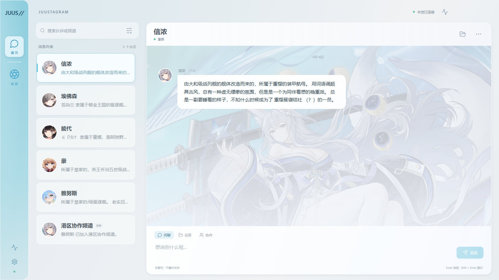
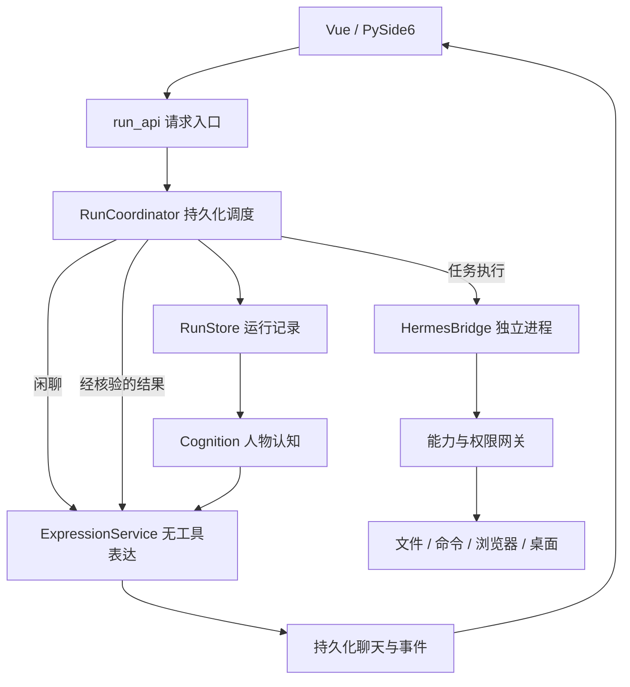

<div align="center">

# AzurJuus

2026-09-21：新增成员可后台补查 Wiki 关系，设置提供可点击的关系图；原作资料、用户覆盖和实际合作经历分开保存。入口、调用链、验证与限制见 [动态关系资料说明](docs/RELATIONSHIP_RESEARCH_20260921.md)。

`deepseek-flash` 的图片闲聊与图片任务已通过真实调用验证；在设置中启用图片输入即可使用，见[视觉接入说明](docs/VISION_DEEPSEEK_20260921.md)。

本地运行的 Agent 桌面应用




</div>

---

## 项目简介

AzurJuus 是一个在 Windows 本机运行的角色化 Agent 桌面应用。界面采用《碧蓝航线》JUUS 通讯与朋友圈的形式，提供角色私聊、群聊、动态和工作抽屉；切换到「任务」或「协作」模式后，角色会实际读写文件、执行命令、读取 PDF/DOCX/XLSX、操作浏览器，或整理 Windows 文件资源管理器等基础操作。

本项目为个人练习项目，不稳定且不定时更新。

系统分成三个部分：

- **AzurJuus 本体** — 持久化调度、权限校验、任务状态与人物状态
- **Hermes** — 以受管理的独立进程承担模型与工具的调用循环，版本锁定在 `hermes.lock.json`
- **独立表达服务** — 把允许公开的事实组织成角色短消息，它不接触工具

对应到运行时有五个职责：界面负责接收与展示，调度器管理工作，Hermes 决定下一次模型或工具调用，权限网关真正操作本机，表达层负责角色说话。「模型说了什么」「工具做了什么」「界面展示了什么」是三件不同的事。

更完善的角色扮演的关系建立还在实验中：
自主社交试验链已支持在线话题判断、邀请建群和共享后台预算，需通过 `AZURJUUS_SOCIAL_ENGINE_ENABLED=1` 启用。群聊成员面板的“人物目录”可预览并启用新增七人，只开放聊天与社交，不自动入群或授予工具权限。十二人的终端基础卡已整理；已有用户修改保留。当前验证和限制见 [人物启用记录](docs/SOCIAL_ROSTER_20260920.md)及[自主社交进展](docs/SOCIAL_ACTIVITY_20260920.md)，自然度与整轮桌面验收尚未完成。

三种模式的区别：

- **闲聊** — 直接交给表达服务生成回复，不先运行执行模型，没有工具权限
- **任务** — 调度器保存运行记录并启动 Hermes，交付通过验收后由表达层根据结果说话
- **协作** — 秘书先生成依赖计划，最多两名执行成员并行，成员之间可以定向讨论

说明：

- **不是完全离线。** 程序、工具执行和数据默认都在本机，但模型调用会发往你配置的服务（云端或本地兼容接口）。使用云端模型时，提示、选中的历史和工具返回内容会外发。
- **不是操作系统沙箱。** 权限控制发生在应用层，获批的命令拥有当前用户的完整权限，工作目录不限制它访问其他路径。
- **这是一个个人练习项目。** 工程机制有实现和回归测试，核心链路做过隔离验收，但没有长期稳定性验证。

## 功能

| 方向 | 当前实现 | 边界 |
| --- | --- | --- |
| 普通对话 | 由角色卡、可见经历和最近对话组成上下文，无工具权限，输出经过规则校验 | 表达自然度仍需人工对照评价 |
| 单人任务 | 执行 → 交付证据检查 → 独立复核 → 表达层生成回复 | 开放式报告的语义正确性仍需合适的验收条件 |
| 多成员协作 | 依赖子任务、最多两名成员并行、成员定向讨论、结果回传原会话 | 讨论建议不能直接改写别人的任务，调整仍需调度校验 |
| 文件与文档 | 分页、搜索、精确补丁、复制移动、快照与撤销；PDF 读取，DOCX / XLSX 读写 | 扫描版 PDF 只标记需要 OCR，未实现自动 OCR |
| 编程 | 修改文件、执行命令、检查输出与退出码、超时与取消 | 示例代码修改与测试修复通过，不代表能自动维护任意仓库 |
| 浏览器 | Playwright 导航、读取、填写、点击、下载，使用任务独立配置 | 本地表单与下载通过，不承诺任意网站稳定自动化 |
| Windows 桌面 | UIA 控件交互、窗口焦点、DPI 缩放、资源管理器整理、停止检查 | 含 Explorer 导航与剪切粘贴实机记录，不含 Office/WPS GUI |
| 人物状态 | 基础卡版本、世界条目、可见经历、有方向的个人判断 | 不是完整心智模拟，自然度受资料与模型制约 |
| 表达投递 | 稳定编号，状态经过排队 → 正文就绪 → 已投递；失败只重投，不重新生成 | 两个数据库之间仍可能暂时不同步，靠恢复补齐 |
| 方法成长 | 有来源的候选在三个隔离场景与原方法比较，通过才启用，可回退 | 只覆盖有限任务族，没有验收器就保留候选 |
| 恢复 | 持久化状态、过期审批失效、未知副作用核验、用户补充排队 | 恢复的是任务上下文，不是原进程的内存快照 |
| 界面 | 组件局部更新、本人消息标识、按会话串行的气泡队列 | 帧率只有测试场景的采样，不代表所有机器 |

## 界面

界面左侧是会话列表与角色头像，右侧是当前会话，底部切换闲聊 / 任务 / 协作。工作抽屉里的分工、工具调用、审批请求和交付文件都来自持久化事件，不是前端模拟的进度；可以随时暂停、继续、停止，或补充新要求。

## 交付与验收

任务是否完成由调度层判定。

成员要交付成果，必须提交结构化的 `deliver`，系统会逐项检查：

| 检查项 | 说明 |
| --- | --- |
| 结构完整 | 必须包含 `summary` 和 `unresolved` 列表；没有未解决项时必须有 `checks` |
| 证据归属 | `checks` 引用的 `callId` 必须存在、成功结束、属于当前阶段，且不能是 `deliver` / `delegate` / `execution_history` / `discuss` |
| 产物存在 | 每个 artifact 必须位于授权工作目录内且是文件 |
| 读取核验 | 交付文件必须由本人用 `read_file` / `read_document` 读过，且读取时记录的 SHA256 与当前文件一致 |
| 不许跳过 | 存在待审批或结果未知的调用时不能完成 |
| 失败要交代 | 失败或被拒的调用需在 `resolvedErrors` 中说明修正方案，并引用发生在它之后的成功核验调用 |

之后还有一个独立的只读复核阶段，会重新读取产物并引用自己的核验调用；发现问题时最多自动修订两轮，仍不通过则暂停任务。

需要说明的是，哈希校验只能证明被检查的内容在检查时没有变化，**不能证明报告结论正确**。语义正确性仍然依赖验收条件和复核。

## 关键机制

| 机制 | 实现 | 边界 |
| --- | --- | --- |
| 执行可靠性 | 调用记录、审批、结构化交付、复核 | 不保证开放式内容永远正确 |
| 恢复 | 持久化状态、事件、请求编号、未知副作用核验 | 任意外部操作不一定可撤销 |
| 事件一致性 | 源事件、消费游标、幂等收件、短事务 | 不是跨库全局事务 |
| 人格连续性 | 基础卡、可见经历、定向关系、版本检查 | 不是完整人类心智模拟 |
| 表达隔离 | 无工具模型、事实包、对象、短消息校验 | 细微失真仍需评测 |
| 投递恢复 | 稳定编号、待投递正文、幂等写入 | 允许暂时不同步后补齐 |
| 技能成长 | 来源候选、三个隔离场景、基线比较、回退 | 有限任务族，不训练权重 |
| UI 稳定性 | 组件局部更新、本人标识、气泡队列 | 性能需要实测 |

其他几处设计：

- 权限校验放在工具网关里，不写在提示词里。路径先解析真实目标再判断是否越界，符号链接和 Windows junction 越界都有回归覆盖。
- 模型等待期间不持有数据库写事务。云端等待可能持续几十秒，长写事务会阻塞其他任务和聊天；实现先取快照、结束事务，再等待模型，最后用短事务提交。人物反思还会检查状态版本，旧结果不能覆盖等待期间的新承诺。
- 崩溃后不自动重放。副作用结果未知时任务转为暂停，需要人工核验文件后再继续。
- `AZURJUUS_EXPRESSION_ENABLED=0` 可以回退到旧的表达链，已有聊天和新投递记录保留。

## 一条任务的流程

以「读取三份文档，生成一份汇总报告」为例：

1. 前端提交会话、内容、模式和请求编号。请求编号防止网络重试重复派工。
2. 后端校验工作目录与模型设置，把请求持久化为运行记录并交给调度器，后台执行与 HTTP 请求分开——接口返回不表示工作完成。
3. 单人任务直接生成一个工作子任务；协作模式先由秘书调用 `delegate` 提交依赖计划（`id / actorId / brief / dependsOn / acceptance`，1–8 个）。调度器检查成员、验收条件与依赖合法性，并检测循环。
4. 每个阶段通过 HermesBridge 启动会话，注入角色卡、工作规则、会话历史、补充要求和上游成果。
5. 模型请求工具时，MCP relay 带着 `callId` 和任务令牌回到本地应用；网关检查运行状态、调用身份与阶段，需要审批时保存具体调用并等待决定。拒绝不是成功，执行者应调整方案。
6. 执行成员提交 `deliver`，系统做上一节的六项检查，随后进入独立的只读复核阶段。
7. 通过后把摘要和产物交给表达服务。协作时传当前群和实际成员，原私聊收到的是系统任务通知，不让秘书以另一个人格插话。
8. 表达结果先保存正文再写入聊天；投递失败时保留正文和稳定编号，恢复时只重投，不重新润色。

## 架构



三个要点：

1. 模型选择下一步动作，应用决定是否允许执行。
2. AzurJuus 负责调度，Hermes 负责执行，两边不重复创建和推进任务。
3. 界面显示的是工具记录和持久化事件里的真实状态，角色口吻只负责表达。

进程模型：Qt 主线程管理窗口，Uvicorn 在同一应用进程的后台线程运行，Hermes 与 MCP relay 是受管理的子进程。进程独立是为了中断干净和依赖解耦，不是安全隔离手段。

### 技术栈

| 层 | 技术 | 职责 |
| --- | --- | --- |
| 桌面壳 | Python、PySide6 6.11.2、QWebEngine | 无边框窗口、缩放、服务启动与异步退出 |
| 界面 | Vue 3、TypeScript、Vite 7 | 私聊、群聊、朋友圈、设置、工作抽屉、认知与方法面板 |
| API | FastAPI、Uvicorn | 消息接收、任务控制、工具入口、产物下载、WebSocket |
| 调度 | asyncio、`RunCoordinator` | 依赖推进、并发、审批、暂停恢复、交付验收与复核 |
| 执行核心 | [Hermes TUI Gateway](hermes.lock.json)（锁定版本） | 模型会话与工具调用循环，JSON-RPC 接入 |
| 工具接入 | MCP stdio + 本机 HTTP | 把上游的工具请求送回应用权限网关 |
| 表达与人物 | `expression.py`、`cognition.py`、`terminal_characters.py` | 短消息生成与校验、经历与关系、基础卡与世界条目 |
| 业务存储 | SQLAlchemy 2.0 + SQLite | 角色、会话、消息、设置、动态、技能 |
| 执行存储 | `sqlite3`、`RunStore`、FTS5 | 任务、调用、审批、事件、表达投递、已验证任务总结 |
| 文档 | pypdf、python-docx、openpyxl | 文档读取与输出 |
| 浏览器 / 桌面 | Playwright、pywinauto、pywin32 | 独立浏览器配置、Windows UI Automation |
| 凭据 | Windows DPAPI（其他平台走 keyring） | 加密保存密钥，HTTP 只暴露是否已配置 |

Hermes 锁定 **v0.21.1 / `04dd80a977f40b05e5b2054111747af07a61886a`**。注意区分：**DeepSeek 是模型服务，Hermes 是执行框架**，项目里没有运行 DeepSeek Harness，也没有自研模型。

## 环境要求

| 项 | 要求 |
| --- | --- |
| 操作系统 | Windows 11（开发与验证环境） |
| Python | 3.11 – 3.13（已验证 3.12.13；3.14 不适用于当前 Hermes） |
| Node.js | 22 LTS |
| 其他 | Git，以及一个可访问的模型服务 |

## 安装

```powershell
git clone https://github.com/DustStarT/AzurJuus.git
cd AzurJuus
python tools/setup_runtime.py
```

安装器会拉取锁定提交的 Hermes 到 `.vendor/hermes-agent`，创建项目独立的 `.venv`，安装依赖，下载 Chromium，并执行 `npm ci` 和 `npm run build`。

安装完成后可以跑一次自检：

```powershell
.\.venv\Scripts\python.exe -X utf8 tools/doctor.py
```

## 运行

```powershell
.\.venv\Scripts\python.exe -X utf8 desktop.py
```

推荐双击 `launch_azurjuus.vbs`，直接打开桌面，不显示命令行窗口。`launch_azurjuus.bat` 仍可用，启动无控制台进程后立即退出（Windows 创建批处理窗口时可能短暂闪现）。启动日志在 `.azurjuus/logs/desktop.log`，启动失败会弹窗提示。

只启动本地网页服务（不带桌面壳）：

```powershell
.\.venv\Scripts\python.exe server.py
# http://127.0.0.1:4173
```

改动前端后需要重新构建，执行 `npm ci` 和 `npm run build`。

Redis、PostgreSQL 和 Chroma 都是可选的，配置与依赖在 `deployment/optional/`，本地启动不需要 Docker。默认使用 SQLite；Redis 缺失时实时通道退回进程内实现，Chroma 缺失时记忆检索退回内存实现。需要完整服务栈时按该目录的说明执行。

## 配置

首次运行后在左下角设置里填写模型接口地址、模型 ID、API Key，并授权一个工作区目录。

- 模型需要支持工具调用，建议至少 64K 上下文。
- 只有确实支持图像输入的模型才应开启视觉定位。
- 回环地址上的本地兼容模型可以不填 Key。
- API Key 在 Windows 上用 DPAPI 加密保存，接口只返回是否已配置，不回传明文。

文件写入、本地命令和桌面动作共用一把串行写锁，桌面另有任务级独占；命令首次使用需要授权。

## 项目结构

```text
azurjuus/
├─ backend/                        本机 HTTP 服务、调度、权限、存储、人物与表达
│  ├─ app.py                       FastAPI 装配、静态资源与业务接口
│  ├─ run_api.py                   任务、审批、产物与运行时事件接口
│  ├─ run_coordinator.py           调度、依赖、并发、交付验收与复核
│  ├─ run_store.py                 持久化准入、检查点与有序事件，事务不等待模型
│  ├─ hermes_bridge.py             锁定版本的 Hermes JSON-RPC 传输
│  ├─ capabilities.py              任务级本地工具：文件、文档、命令、浏览器、桌面
│  ├─ tool_gateway.py              遗留工具 schema 与旧网关（生产执行走 capabilities.py）
│  ├─ mcp_host.py                  最小 MCP stdio 中继，执行与授权归应用所有
│  ├─ expression.py                无工具表达生成，带幂等的投递发件箱
│  ├─ personality.py               共享表达规则：影响措辞，不影响工具权限
│  ├─ character_behavior.py        对已发布角色素材的行为解读
│  ├─ terminal_api.py              终端会话、角色卡、世界书与提示预览接口
│  ├─ terminal_characters.py       带版本的基础角色卡与世界条目
│  ├─ collaboration_dialogue.py    与文件执行并行的成员讨论，消息持久化
│  ├─ cognition.py                 事件驱动的人物记忆与 CAS 反思
│  ├─ cognition_api.py             人物心智、关系与经历接口
│  ├─ cognition_models.py          业务侧认知投影，执行真相仍在 RunStore
│  ├─ skill_runtime.py             方法选择与使用记录
│  ├─ skill_growth.py              基于证据的候选晋升，使用隔离的真实工具执行
│  ├─ social_runtime.py            社交运行时
│  ├─ idle_social.py               低优先级动态与评论生成
│  ├─ personal_settings.py         本地用户档案与记录、记忆管理
│  ├─ llm_runtime.py               模型调用与流式处理
│  ├─ memory.py                    记忆检索
│  ├─ realtime.py                  实时事件通道
│  ├─ workflow_view.py             历史流程只读展示，新任务走 RunCoordinator
│  ├─ services.py                  业务数据装配
│  ├─ database.py                  业务库会话与引擎
│  ├─ models.py                    业务数据模型
│  ├─ migrations.py                数据库迁移
│  ├─ credentials.py               凭据加密存取，保存后不再跨越 HTTP 边界
│  ├─ config.py / constants.py     配置读取与常量默认值
│  ├─ sqlite_policy.py             规避未修复 SQLite 的 WAL-reset 竞态
│  └─ __init__.py                  包导出
├─ frontend/                       Vue 3 + TypeScript 界面
│  ├─ App.vue                      主界面、视图切换与左右对齐判定
│  ├─ SpeechBubbles.vue            分段气泡渲染
│  ├─ speechQueue.ts               按会话串行的呈现队列
│  ├─ WorkDrawer.vue               工作抽屉
│  ├─ MindPanel.vue                人物认知面板
│  ├─ MethodPanel.vue              方法与成长面板
│  ├─ SettingsPanel.vue            设置
│  ├─ CharacterCard.vue / Avatar.vue / Icon.vue   角色卡、头像占位与图标
│  ├─ api.ts / types.ts / assets.ts               接口客户端、共享类型、资源路径
│  ├─ main.ts                      应用入口
│  └─ theme.css                    设计变量与组件样式
├─ deployment/optional/            可选的 Docker 服务与依赖
├─ resources/characters/           角色导入素材（JSON + prompt）
├─ tools/                          安装、自检与验收脚本
├─ tests/                          后端回归测试
├─ docs/                           本地说明文档（不纳入版本控制）
├─ validation/                     本地验收产物（不纳入版本控制）
├─ desktop.py                      桌面壳入口（PySide6 / QWebEngine）
├─ server.py                       纯网页服务入口
├─ launch_azurjuus.bat / .vbs      启动入口
├─ index.html / vite.config.ts     前端入口与构建配置
├─ tsconfig.json / package.json    类型配置与前端依赖脚本
├─ requirements*.txt               运行、测试与打包依赖，另有 Windows/Py3.12 约束锁
├─ .env.example                    配置样例
├─ hermes.lock.json                锁定的 Hermes 版本与提交
├─ screenshot.png                  README 主界面截图
└─ LICENSE
```

如果需要读代码，建议按这个顺序，不要从 `services.py` 第一行开始：

`frontend/App.vue` → `backend/run_api.py` → `backend/run_coordinator.py` → `backend/hermes_bridge.py` → `backend/capabilities.py` → `backend/run_store.py`

`services.py` 负责业务数据、人物、技能和社交，从入口跳转实际调用即可，不必逐行阅读。

## 测试

```powershell
# 后端回归
.\.venv\Scripts\python.exe -m pytest tests -q

# 前端类型检查与构建
npm run build

# 浏览器布局与消息节奏（需要两个终端）
.\.venv\Scripts\python.exe tools/ui_test_server.py
.\.venv\Scripts\python.exe -X utf8 tools/terminal_ui_acceptance.py

# 桌面壳渲染验收
.\.venv\Scripts\python.exe -X utf8 tools/qt_acceptance.py
```

验收脚本只向新建的隔离目录写入合成数据，不会改动你的工作区。

| 脚本 | 验证内容 |
| --- | --- |
| `tools/terminal_ui_acceptance.py` | 三种桌面宽度下的气泡对齐、同会话消息排队、历史不重播、抽屉帧率采样 |
| `tools/ui_message_acceptance.py` | 流式分段与消息节点连续性、中文输入、焦点与选区保持 |
| `tools/qt_acceptance.py` | 真实 PySide6 / QWebEngine 在 1.0 / 1.25 / 1.5 应用缩放下的渲染 |
| `tools/batch_execution_acceptance.py` | 原始启动入口整轮：闲聊、文件任务、只读查询、讨论、依赖交接与退出 |
| `tools/desktop_acceptance.py` | 只操作新建的合成目录与独立 Explorer 窗口 |
| `tools/collaboration_expression_acceptance.py` | 真实模型的协作表达原文与耗时 |
| `tools/personality_benchmark.py` | 人物对照评价材料生成 |
| `tools/doctor.py` | 环境自检：Python、SQLite、模块、Hermes 提交是否匹配、UI 是否已构建 |

当前本机实测：后端 85 项回归通过，前端类型检查与构建通过。这是一次测试运行的结果，不代表覆盖率、真实任务成功率或性能指标。程序测试、真实模型、桌面检查与人工评价是四类独立证据，不能互相替代。

## 已知限制

1. 人格自然度需要匿名人工对照评价，消息长度比例和程序通过率不能替代。材料已生成，评分尚未完成。
2. 不是操作系统沙箱。获批命令拥有当前用户权限，路径前缀判断不能覆盖脚本的全部副作用，也没有宣称解决提示注入问题。
3. 哈希校验只证明内容在检查时未变化，不能证明结论正确。同一权限下的外部程序仍可能在检查后改写文件。
4. 不是严格 Event Sourcing。当前是状态快照加持久化事件日志，两个数据库之间没有分布式事务，不承诺所有副作用 exactly-once。
5. 重启恢复的是任务上下文，不是进程内存。未完成任务需要在工作抽屉里手动继续，旧审批一律失效；任意外部操作不一定可撤销。
6. 复核者通常仍是同一个基础模型，可能存在相关性错误，不等同于两个独立专家。
7. 桌面自动化范围有限。没有 Office / WPS GUI 自动化，没有任意专业软件承诺，扫描版 PDF 只标记不做 OCR。
8. 性能数据范围有限。采样中仍出现过超过 50ms 的长任务，不能承诺所有机器持续 60 帧。
9. 方法成长只覆盖有限任务族，没有验收器的任务族保留候选，不称为通用自主学习。
10. 历史数据结构仍有维护成本。本轮清理了失效的执行逻辑，保留历史只读展示。

## 本地文档

`docs/` 与 `validation/` 只在本机保留，不纳入版本控制。其中包括技术报告、逐层代码讲解、按日期记录的改造与验收过程，以及各轮验收的截图与报告。

这些材料写于各自的实现阶段，其中的测试数字、文件路径和能力描述不一定对应当前代码；本 README 描述的是当前实现。

## 第三方素材与许可证

- **角色数据**来自[碧蓝航线 BWIKI](https://wiki.biligame.com/blhx/)，由 `tools/blhx_character_import.py` 抓取整理。《碧蓝航线》的角色设定、台词与美术素材版权归**蛮啾网络**与**勇仕网络**所有。仓库不包含任何图片文件，立绘只保存远程 URL。详见 [`resources/characters/README.md`](resources/characters/README.md)。
- **默认数据目录**是 `.azurjuus/`（SQLite 数据库、任务日志、浏览器配置），可能包含聊天记录和加密凭据，已被 `.gitignore` 排除。
- `screenshot.png` 以及本地 `validation/`、`docs/` 中的任务与聊天内容均为隔离的合成样例。

本项目代码以 [MIT 许可证](LICENSE) 开源。需要单独说明的是，**MIT 只覆盖本项目代码**：`resources/characters/` 下的角色素材抓取自社区 wiki，版权归《碧蓝航线》权利方所有，不在 MIT 授权范围内。
