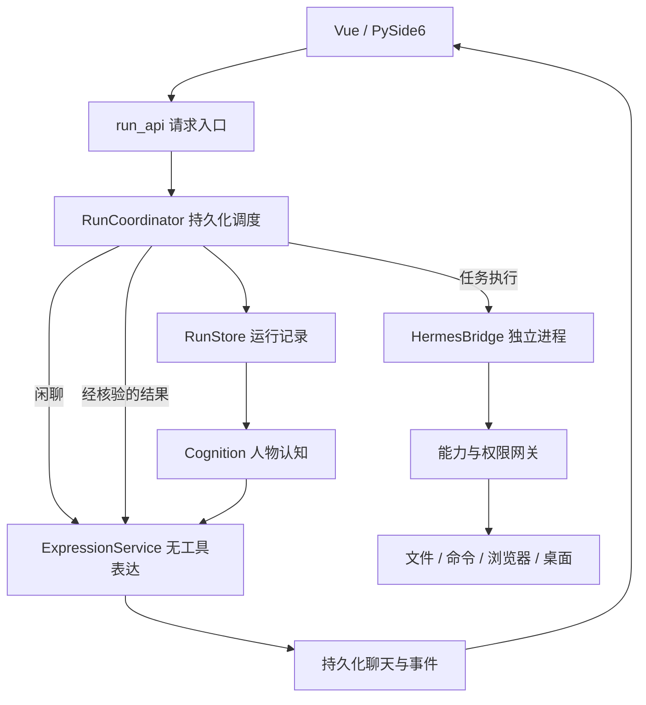

# 从界面到文件：AzurJuus 当前代码讲解

更新：2026-09-17。本文沿默认执行链解释实现。全貌见 [技术报告](TECHNICAL_REPORT.md)，口头表达见 [面试讲解](INTERVIEW_GUIDE.md)，验证见 [本轮记录](UI_COLLAB_CLEANUP_20260917.md)。历史计划不等于当前实现清单。

## 1. 先抓住五个职责

界面接收和展示，调度器管理工作，Hermes 决定下一次模型或工具调用，权限网关真正操作本机，表达层负责角色说话。“模型说了什么”“工具做了什么”“界面展示什么”是三件事。

## 2. 推荐阅读顺序

| 文件 | 要回答的问题 |
| --- | --- |
| frontend/App.vue | 发给哪个会话，用什么模式，消息和任务卡如何区分？ |
| backend/run_api.py | 怎样保存请求、安装回调、关联群组与私聊？ |
| backend/run_coordinator.py | 怎样排依赖、验收、审批、暂停与关闭？ |
| backend/hermes_bridge.py | 怎样启动进程，通过 JSON-RPC 收发事件？ |
| backend/capabilities.py | 哪个工具真正动磁盘，怎样检查权限？ |
| backend/run_store.py | 哪些状态保存，怎样重放事件、识别重复请求？ |
| backend/expression.py | 怎样生成短消息，失败如何恢复？ |
| backend/collaboration_dialogue.py | 定向问题怎样进入同伴上下文？ |
| backend/cognition.py | 谁能看到什么，事件怎样改变人物状态？ |
| backend/skill_growth.py | 方法候选怎样试用、启用与回退？ |

services.py 负责业务数据、人物、技能和社交。不要逐行背诵，从入口跳转实际调用即可。旧模拟执行循环和失效手工工具路径已清理；workflow_view.py 仅展示历史流程，不调度新任务。

## 3. 跟一遍“整理工作区文件”

App.vue 提交 /api/messages/send，包含会话、内容、模式和请求编号。请求编号防止网络重试重复派工；会话编号决定展示位置。

run_api.py 读取人物、设置和历史，交给调度器。RunStore.create 保存记录，后台执行与 HTTP 请求分开。因此接口返回不表示工作完成。

RunCoordinator.run 区分闲聊、单人任务和协作。任务通过 execute_actor 创建 Hermes 会话，桥接层传递本次阶段上下文。工具调用回到应用入口，不能绕过网关直接成为成功记录。

tool 检查运行、调用身份和阶段；需要审批时保存具体调用并等待决定，授权后才执行。拒绝不是成功，执行者应调整方案。用户补充也在执行边界送入上下文。

deliver 接收结构化成果，检查证据并推进子任务，最后复核通过才完成。文件存在只证明存在，检查条件应匹配实际交付要求。

完成回调将摘要和产物交给表达服务。协作时传当前群及实际成员；原私聊收到系统任务通知，不让秘书以另一个人格插话。

## 4. 协作不只是顺序发五次请求

子任务保存负责人、依赖、要求和交付。execute_assignments 找到依赖已满足的工作，最多两个执行成员并行；任一完成即重新调度，短任务不用被同批长任务拖住。

CollaborationDialogue.send 保存对象、线程和可见范围。原始观点与实际短句分别保留，答复读取对方真正说出的内容、原始意图和同线程上下文，避免双方各写一份报告。

执行者在后续工具边界通过 take 接收讨论。建议改变职责和依赖仍需调度校验；讨论有往返限制，不能自己宣布验收通过。交互调用有独立槽位，不代表所有云端请求无限并行。

关系按接收者或实际群成员筛选，不把所有角色当作参与者。群收尾只读取公开讨论，不能混入私人讨论。

## 5. 执行与表达在哪里分开

默认 AZURJUUS_EXPRESSION_ENABLED=1。execute_actor 把 Hermes 文字转成 execution.message.* 进入工作记录，不作为角色聊天发布。关闭开关是旧行为回退，不属于新表达验收。

ExpressionService.speak 接收人物、意图、事实包、来源与对象。加入生效角色版本、可见认知、相关世界条目和近期对话，不提供工具权限。

模型返回分段正文和来源编号。validate 检查段数、长度、动作旁白及部分明显事实矛盾；失败最多修订一次。规则不能证明所有语义正确，细微编造仍需评测。

普通目标 30–120 字，上限 180 字；明确详细追问另行处理。这不是前端截断：完整正文先保存，再控制呈现节奏。

## 6. 消息恢复为何不会反复说

运行库 speeches 保存 queued → ready → delivered：准备生成、正文可投递、已经投递。编号来自来源事件，恢复时不改变。

生成后发布失败，保留 ready 与正文，恢复只重投，不重新润色。同一编号写入聊天时防重复，前端按编号更新。两库间仍可能暂时不同步，通过恢复补齐，不是假设一个事务包住数据库与网络。

任务表达失败只记录 expressionError，不撤销交付。闲聊本身就是生成回复，失败应显示错误，不伪造成功话术。

## 7. 人格状态不是长提示

基础卡、世界背景、经历和个人判断分开保存。基础卡支持版本与用户覆盖，不因文件更新就静默替换用户人设。

Cognition.pump 读取运行事件，按可见范围形成经历。收件记录、游标和状态变更在业务侧同事务提交，重放不会重复累加关系。上下文先按权限筛选，再取相关摘要。

反思在事务外调用模型，提交时检查状态版本。旧反思不能覆盖新承诺。忘记经历影响派生认知检索，不删除工具审计事实。关系有方向，不是所有人共享的好感表。

这些机制管理连续性与信息，不直接证明说话自然；原作资料、检索质量和模型都会影响效果。

## 8. 方法成长如何验证

skill_runtime.py 选择已有方法、记录使用；skill_growth.py 管候选、隔离试用、启用和回退，不是两套调度器。

候选需有可见来源和已验证结果。在支持的任务族中，原方法与候选分别跑三个场景，用同一验收器检查结果和权限。全部通过才启用个人版本；缺少验收器就保留候选。公有发布另有审核与用户确认。

目前主要支持有限的文件清单与整理任务族。不是任意任务都能自我改进，更没有更新模型权重。

## 9. 前端对齐与消息节奏

App.vue 用实际用户编号判定左右；SpeechBubbles.vue 显式接收 self，内部容器让短气泡右对齐。只反转头像行不够，内部段落仍可能贴左。

稳定消息和分段编号避免节点反复创建。呈现队列控制出现时间，不改数据库正文；历史加载和重连不重播全部动画。输入框不应随消息整页重建。

本轮坐标验收测量头像、气泡和行，覆盖短句、长句与三个桌面宽度。帧率另行采样，布局正确不等于持续流畅。

## 10. 关闭与维护

关闭先停止后台工作，取消等待，再关闭受管理进程和连接。审批与模型等待必须可取消。重启遇到未知副作用先核验，不能盲目重放写入或提交。

FastAPI 是桌面核心；删掉就失去数据与执行服务。Docker、Redis、PostgreSQL、Chroma 不是默认前置条件。

清理代码不删除真实 .azurjuus、历史数据库、备份和锁定依赖。本轮移除无生产调用者的旧执行逻辑，历史表与只读视图保留。
