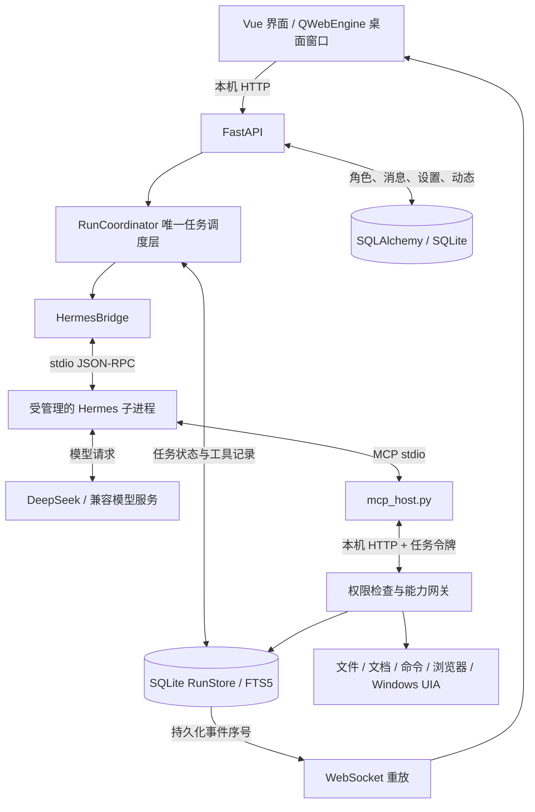
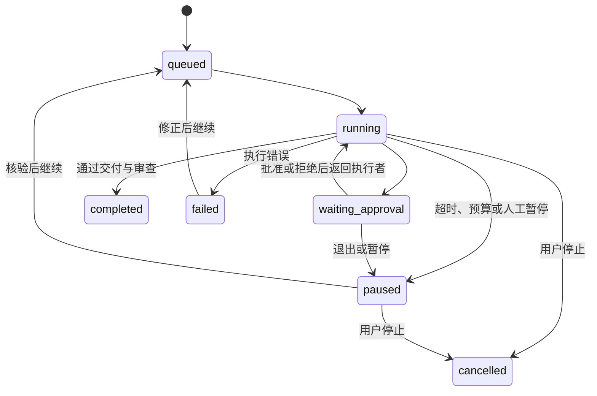

# AzurJuus 项目现况与面试讲解

2026-09-16 补充：[人物认知与成长实现讲解](COGNITION_GUIDE.md)。下文 70 项测试数字属于历史版本，不是新增认知机制的验收成绩。

## 新增人格架构如何回答追问

**为什么不用超长人设提示？** 长提示不能自动解决跨会话状态分叉、个人信息边界和重复学习。项目将身份、经历、关系判断和当前状态分开持久化，每轮只给模型当前人物可见的相关部分。

**并发怎样保持同一个人格？** 私聊、工作与讨论共享一份带版本号的状态。版本 10 发出的反思，在新要求使状态变成 11 后不能覆盖它。模型请求在事务之外，数据库写入使用短事务和条件版本检查。

**两个数据库怎样同步？** 工具运行事件是源，认知消费游标、收件标识和人物更新在业务侧同事务提交。发件箱负责变化通知重试。可能重复投递，但同一事件对同一人物只更新一次；不是承诺网络“恰好一次”。

**学习改变模型权重了吗？** 没有。它更新外部方法与经验。候选在独立工作区完成三个场景，并与原方法使用相同文件验收，才能启用。无可靠验收器的任务族不自动晋升。

**怎么证明人物更自然？** 功能测试证明数据、恢复和工具正确性；自然度需要匿名人工对照。当前不能宣称达到计划中的 65% 人工胜出率，也不能称为完整人类心智模拟。

2026-09-14 补充：如果现在难以把控代码，先读 [从界面到文件：逐层代码讲解](CODE_WALKTHROUGH.md)。它按一次请求追踪到具体函数，详细解释任务状态、依赖调度、成员讨论、交付证据、数据库事务、人格隔离、气泡渲染、恢复与技能边界。本文用于组织面试表达，配套讲解用于理解实现。

最新状态：70 项后端回归通过；工作执行最多两名成员并行，另有一个无文件工具的讨论通道。协作结果以系统通知回传私聊，方法成长面板已加入。下方 9 月 13 日数字与截图属于当日历史基线，当前差异以 [本轮记录](PERSONALITY_COLLABORATION_20260914.md) 为准。

整理日期：2026-09-13。以当前代码和 `validation/` 中已有验证记录为依据。本材料中的第一人称话术用于组织表达，个人负责范围请按实际参与情况调整。

## 1. 项目应该怎样定位

**一句话：AzurJuus 是一个带角色化通讯界面的本地 Agent 桌面应用，重点是让模型通过受控工具完成任务，并留下可核验的产物和执行记录。**

界面参考 JUUS 通讯和朋友圈，提供角色私聊、群聊、动态及工作抽屉。实际工作包括文件整理、文档阅读与输出、命令执行、浏览器操作和 Windows 文件资源管理器操作。

“本地”指程序、工具执行和默认数据存储在本机。当前实际验收使用 DeepSeek 云端模型，也保留本地兼容模型接口。使用云端时，提示、选取的历史和工具返回内容可能发往模型服务，不能把它描述成完全离线应用。

当前适合称为：**已打通核心闭环、经过隔离验收的个人项目原型**。有真实任务结果，也仍有长期稳定性、复杂任务效果和安全隔离方面的工作。

### 30 秒版本

> 这个项目叫 AzurJuus，是一个本地 Agent 桌面助手。我希望它既能保留角色化聊天和协作体验，也能实际完成文件、文档和编程任务。执行部分接入 Hermes，但任务调度、权限、持久化和交付验收由应用自己管理。重点是模型必须提供实际产物和工具证据，不能只回复“完成了”。目前已经通过 DeepSeek 的普通对话、文件任务和两成员文档协作验收。

### 2 分钟版本

> AzurJuus 的出发点是把角色化交互和实际工作的 Agent 结合起来。早期版本的问题是：角色能够汇报进度，但工具循环、审批和任务状态没有形成可靠闭环，所以看起来在工作，实际未必有交付。
>
> 重构后，前端使用 Vue 3 和 TypeScript，FastAPI 提供接口，PySide6 的 QWebEngine 承载桌面窗口。Hermes 以受管理的独立进程运行，负责模型与工具之间的执行循环。应用保留唯一的任务调度层，管理子任务依赖、并发、审批、恢复和成果验收。
>
> 所有本地工具都经过统一网关。一个成员完成工作后，要提交文件路径和自己的成功核验调用。系统检查文件存在、证据属于当前阶段、读取时的哈希与当前文件一致，再由单独的只读审查阶段复核。复杂任务最多两个成员同时执行，文件写入、命令和桌面动作受到共享资源约束。
>
> 比较有代表性的排障是：接口测试通过，但用户双击启动后一直没回复。最后发现相对 HERMES_HOME 在子进程切换工作目录后指向另一个位置，模型配置根本没有被加载。修复不仅是固定绝对路径，还把真实批处理入口、相对配置路径和界面中的最终回复加入了验收。当前完整后端回归有 68 项通过，但我会明确区分这些验收与长期生产可靠性。

## 2. 当前到底做到什么程度

| 方向 | 当前实现 | 验证与边界 |
| --- | --- | --- |
| 普通对话 | 角色设定、会话历史、流式消息；闲聊无工具授权 | 实际批处理入口下“能代／你好”有最终回复 |
| 单人任务 | 执行、读取核验、独立审查、交付文件 | DeepSeek 实际生成报告，下载与文件内容核对 |
| 多成员协作 | 独立任务群、依赖计划、成员回复、原会话回传、最多两个执行成员并发 | 两成员 TXT/DOCX/XLSX 汇总通过；不代表任何任务都应拆分 |
| 文件与文档 | 分页、搜索、补丁、复制移动、快照、撤销；PDF/DOCX/XLSX | 工具回归与合成文档验收；扫描 PDF 没有自动 OCR |
| 编程 | 修改文件、运行命令、检查输出与退出码、超时与取消 | 示例代码修改与测试修复通过；不等于能自动维护任意大型仓库 |
| 浏览器 | Playwright 导航、读取、填写、点击和下载 | 本地测试页面、表单与下载工具验收；未承诺任意网站稳定自动化 |
| Windows 桌面 | UIA、窗口焦点、DPI、控件快照、Explorer 整理与停止检查 | Explorer 导航、选择、移动和撤销有实机记录；不含任意专业软件和 Office GUI |
| 社交与方法 | 角色、关系、动态、评论、角色方法选择与成功 SkillRun | 协作学习只生成禁用的私有候选，试用和晋升未完成 |
| 恢复 | 持久化状态、过期审批处理、未知副作用核验、用户手动继续 | 恢复任务上下文和记录，不是恢复原进程的内存快照 |
| UI | Vue 局部更新、稳定消息 ID、中文输入保护、按批加载、图片预加载 | 有浏览器及 QWebEngine 截图和交互验收；没有覆盖所有 GPU、DPI 与长时间运行组合 |

当前数据：后端 **68 passed / 73.66 秒**，3 项上游弃用警告；前端最近构建通过。这些是一次测试运行结果，不是覆盖率、真实任务成功率或性能 SLA。

## 3. 技术栈与分工

| 层 | 技术 | 在项目中的职责 |
| --- | --- | --- |
| 桌面壳 | Python、PySide6、QWebEngine | 窗口、最小化、缩放、服务启动及异步退出 |
| 界面 | Vue 3、TypeScript、Vite | 私聊、群聊、朋友圈、设置和工作抽屉 |
| API | FastAPI、Uvicorn | 消息接收、任务控制、工具入口、产物下载及 WebSocket |
| 调度 | asyncio、RunCoordinator | 依赖推进、并发、审批、暂停恢复、验收与修订 |
| 执行核心 | 锁定提交的 Hermes TUI Gateway | 模型会话和工具调用循环，JSON-RPC 接入 |
| 工具接入 | MCP stdio + 本机 HTTP | 将 Hermes 的工具请求送回应用权限网关 |
| 业务存储 | SQLAlchemy、SQLite | 角色、会话、消息、设置、动态、技能等 |
| 执行存储 | sqlite3、RunStore、FTS5 | 任务、工具调用、审批信息、事件、已验证任务总结 |
| 文件与文档 | pathlib、pypdf、python-docx、openpyxl | 文件操作及文档读取、输出 |
| 浏览器与桌面 | Playwright、pywinauto、pywin32 | 独立浏览器配置、Windows UI Automation |
| 凭据 | Windows DPAPI；其他平台有 keyring 路径 | 保存密钥；HTTP 仅暴露配置状态 |

Hermes 当前锁定 v0.21.1 对应提交；模型验收使用保存的 `deepseek-flash`。**DeepSeek 是模型服务，Hermes 是执行框架**。项目没有同时运行 DeepSeek Harness，也没有自研基础模型或训练、微调模型。

## 4. 架构怎样画、怎样讲



讲图时抓住三个关系：

1. **模型选择下一步，应用决定是否允许执行。** 权限不只写在提示词里。
2. **AzurJuus 调度，Hermes 执行。** 避免两套系统都创建、分配和推进任务。
3. **界面显示真实状态。** 任务进度来自工具记录与持久化事件，角色口吻负责表达。

桌面并非“整个后端一个独立进程”：Qt 主线程负责窗口，Uvicorn 在同一应用进程的后台线程运行；Hermes 与 MCP relay 是受管理的子进程。进程独立有利于中断和依赖解耦，但不是安全沙箱。

## 5. 一条任务从输入到交付发生什么

以“读取三份文档，生成一份汇总报告”为例：

1. 前端提交 `conversationId`、内容、模式和 `requestId`。
2. 后端验证工作目录、角色和模型设置，持久化任务；相同请求标识返回同一任务，并检查请求内容是否一致。
3. 用户消息采用稳定 ID 写入。后台启动执行，接口不等待整个模型任务完成。
4. 单人任务直接生成一个工作子任务；协作模式先让秘书通过 `delegate` 提交结构化依赖计划。
5. 调度器检查子任务 ID、负责人、目标、验收条件和依赖合法性，检测循环，再运行依赖已完成的子任务。
6. 每个阶段通过 HermesBridge 启动会话，输入角色设定、工作规则、会话历史、补充要求及已有执行记录。
7. 模型请求工具；MCP relay 把请求连同调用 ID 和任务令牌发回本地应用。
8. 网关校验权限，记录调用；需要审批时等待用户决定，批准后继续原调用，拒绝则把原因交回执行者。
9. 执行成员通过 `deliver` 提交结构化成果。系统检查证据与实际文件，记录交付元数据。
10. 单独审查阶段重新读取产物，引用自己的核验调用。发现问题时最多自动修订两轮，仍有问题则暂停。
11. 任务完成后写入稳定的结果消息并通知界面。下载产物时再次检查文件是否改变。

当前 `delegate` 接受 1–8 个子任务。依赖计划里的关键字段是 `id / actorId / brief / dependsOn / acceptance`，这比让角色仅在群聊中说“我负责分析，你负责写作”更可执行。

## 6. 多智能体具体是什么

这里的 Agent 主要由**模型调用上下文、角色设定、阶段权限和任务目标**区分。多个角色可以使用同一个基础模型，不意味着每个角色训练了一个专门模型。

| 阶段 | 工具范围 | 原因 |
| --- | --- | --- |
| 闲聊 | 无工具 | 普通对话不应触发本地副作用 |
| 规划 | delegate、execution_history | 提交计划与查阅已有记录 |
| 执行 | 获准本地能力及 deliver，不含 delegate | 专注完成已分配工作 |
| 审查 | 读取、搜索、列目录、执行历史及 deliver | 核验已有产物，避免擅自扩展工作 |

不仅后端会拒绝越权动作，MCP 的工具描述和 action 枚举也按阶段裁剪，减少模型尝试根本不可用操作的轮次。MCP 当前主要暴露一个 `workspace` 工具，通过 `action + args` 分派能力；不要把它误讲成每个动作都是一个独立 MCP 服务。

依赖交接通过结构化成果、产物路径和执行记录完成；必要历史也传入模型。当前并发采用信号量及分批 TaskGroup，最多两个执行成员；不是多机分布式调度器，也不是任意规模的 Agent 集群。

**为什么不是成员越多越好？** 多拆分会增加上下文传递、模型调用和审查成本；共同编辑一个文件或共享桌面还会产生冲突。项目把并发作为受约束的优化，只在任务可拆分时使用。

**独立审查是不是完全独立？** 是执行阶段和工具证据独立，审查者必须自己读取；通常仍使用同一基础模型，可能有相关性错误，不能当作两个完全独立专家的保证。

## 7. 怎样判断“真的完成”

项目使用两层检查：确定性的程序检查，以及模型对内容和用户要求的复核。

示例交付请求：

```json
{
  "summary": "生成了包含来源说明的汇总报告",
  "artifacts": ["report.docx"],
  "checks": [{"callId": "实际读取调用的ID", "description": "读回报告并核对来源"}],
  "unresolved": []
}
```

程序会检查：

- 调用存在，成功完成，属于同一个任务和当前阶段。
- `deliver`、`delegate` 和查询执行历史本身不能冒充验证证据。
- 每个产物存在于授权工作目录中。
- 当前成员读取过该文件，读取记录的 SHA256 与当前文件相同。
- 待审批或结果未知的调用不能被跳过。
- 失败或拒绝的操作需要说明修正方案并引用后续成功核验，或者明确列为未解决事项。

面试时必须补充：**哈希只能证明“被检查的是这份内容，且检查时没有变化”，不能证明报告结论正确。** 语义正确性仍依赖任务验收、审查和更有针对性的检查；同一用户权限下的外部程序也可能在检查后改写文件。

## 8. 状态、审批、恢复和幂等



图表示主要路径；程序重启还会把未结束运行转为暂停。

### 数据怎样存

- 业务库保存聊天、角色、设置、动态等。
- `runs.db` 的 `runs` 保存当前状态和 JSON 任务数据；子任务、产物清单、补充要求等包含在任务数据中。
- `calls` 保存参数、结果、审批决定和阶段关联。
- `events` 保存自增序号、类型、关联任务和载荷。
- `memory_fts` 保存已验证任务总结，使用 SQLite FTS5 检索。

当前是“状态快照 + 持久化事件日志”，不是把所有状态都从事件重建的严格 Event Sourcing。两个数据库之间也没有分布式事务。

### 为什么模型等待时不持有数据库写事务

模型请求耗时不可控。持有写事务等待网络会阻塞其他消息、审批和状态更新。项目在短事务中读取需要的数据，退出会话后等待模型，再用短事务保存结果。

### 怎样防重复

`requestId` 防止重复创建同一任务；工具 `callId` 命中已有记录时检查任务、参数及阶段，避免再次执行同一调用；用户消息和结果消息使用稳定 ID。

但 MCP relay 的新调用会生成新 ID，因此模型重新发起的相同语义动作不一定能仅靠 ID 去重。应用也无法和外部文件系统、网页服务做一个原子提交。不要承诺“所有副作用 exactly-once”。

### 写入完成、记录没保存就崩溃怎么办

此时系统不能确定副作用是否已发生。重启后将相关运行暂停，保留未知调用，要求核验文件或页面后继续，避免自动重复。继续时重新建立执行会话，输入历史成果与工具记录，已经完成的子任务可以跳过。

若任务结果已经保存、结果消息尚未写入，启动恢复会检查缺失消息并通过稳定消息 ID 补投。这是应用层的恢复与幂等处理，不是跨库原子事务。

### 中途补充要求怎么办

要求先落盘，再尝试送达运行会话；记录排队和消费情况。若最后一轮已经结束，但还有未消费补充，任务暂停，避免把尚未处理的新要求算作完成。

## 9. 权限和并发的技术边界

文件路径先解析实际目标，再检查是否在授权目录内，并禁止把运行时状态和凭据目录作为任务操作目标；回归覆盖符号链接及 Windows junction 越界。

命令首次使用需要任务授权，浏览器和桌面高影响交互有具体审批。工具入口校验任务令牌、阶段和运行状态。本地 HTTP 还有 Host、Origin 等检查，降低恶意网页直接调用本地接口的风险。API Key 在 Windows 用 DPAPI 保存，界面只显示是否已配置；运行时仍需解密供模型客户端使用。

文件写入、本地命令和桌面动作使用应用内共享写锁；桌面还有任务级独占。原生线程无法像协程一样即时取消，因此取消后仍等待正在进行的原生调用退出，再释放锁，防止后续任务与它重叠操作。

必须清楚的限制：这是一层应用权限控制，**没有容器或操作系统级进程沙箱**。获准命令拥有当前用户权限，工作目录不限制它访问其他路径；进程内锁也无法约束外部程序。因此也不能承诺已解决所有提示注入、越权脚本或任意桌面自动化风险。

## 10. UI 与实时同步怎样讲

原来通过重建整个页面 DOM 更新界面，容易打断输入、焦点、选区和滚动，动画也会被重复触发。现在用 Vue 组件和稳定消息 ID 做局部更新。

- 流式事件通过 requestAnimationFrame 批量刷新，减少高频状态提交。
- 默认只渲染最近 100 条消息，更早内容按批加载。当前是分批渲染，不是完整的窗口虚拟列表。
- 输入框保护 composition 状态，中文输入法选字时 Enter 不直接发送。
- 动画以 transform 和 opacity 为主，减少大面积持续模糊；抽屉约 220ms，按钮约 150ms。
- 图片集中预加载，有缺失占位和桌面磁盘缓存。

运行事件带持久化序号。WebSocket 断线后从游标继续请求，前端忽略已处理序号；检测缺口或游标超出当前状态时触发同步。当前运行事件由 SQLite 日志读取并发送，不依赖 Redis 消息队列保证恢复。

现有性能记录：特定测试环境下 720 帧测量的中位数约 16.7ms、p95 约 16.8ms，没有记录到 longtask。只能说明该测试场景接近 60fps，不能宣称所有机器都稳定 60fps，也不能用粗粒度堆内存读数证明没有泄漏。

## 11. 最值得讲的三个排障案例

### 案例 A：接口测试成功，双击运行却不回复

**现象：** 用户给能代发送“你好”，一直等待，120 秒后超时；隔离 API 和桌面测试却通过。

**调查：** 加入核心启动、会话准备、事件类型等脱敏诊断。发现应用预期目录只有配置与 bridge 日志，Hermes 的状态数据库出现在上游源码下面的另一个 `.azurjuus` 目录。

**根因：** `.env` 使用相对状态路径，生成的 `HERMES_HOME` 也是相对路径；父进程在应用目录写配置，子进程切换到 `.vendor/hermes-agent` 后从错误目录读取，丢失 DeepSeek 和工具配置。错误日志走到了默认 OpenRouter 路径。

**修复：** 配置中的相对路径以应用目录为基准解析；启动子进程前再次固定绝对 home 和源码路径。测试增加相对路径、原始 bat 入口、普通问候，并精确等待 `<run-id>-result` 的智能体消息。

**结果：** 同样相对路径条件下，“能代／你好”和文件任务通过；新对话运行中退出约 0.64 秒，无残留测试子进程。

**可直接讲的教训：** 测试里的绝对路径比真实环境更规范，反而掩盖了问题。部署入口、cwd 和进程环境属于系统行为的一部分，不能只验证 API 正常返回。测试断言也要检查智能体回复，不能误匹配用户输入中的标记。

### 案例 B：窗口关闭必定卡住

**根因有两层：** Qt 主线程同步等待后端线程；后端又可能等待尚未完成的审批 HTTP 请求，而取消审批请求的逻辑位于更晚的生命周期清理阶段。

**修复：** Qt 发出退出请求后保留事件循环，后台线程执行停止；先取消模型和工具等待，再让 Uvicorn 排空请求。多个关闭入口共用一次清理，退出中的任务持久化为暂停，按顺序释放 WebEngine 页面及配置对象。

另有实测发现：当前 Uvicorn 默认 SansIO WebSocket 实现在页面断开时存在重复关闭异常。项目暂时明确选择现有可用实现，并记录上游弃用警告和后续升级验证要求。

**教训：** async 应用仍可能被同步 join 卡住；关闭顺序也是并发协议，不能只在空闲时测试退出。

### 案例 C：模型说完成了，实际没有成果

**根因：** 早期流程把成员返回的文字当作完成信号，甚至可能覆盖工具设置的 waiting_approval。

**修复：** 将完成权收回调度层。成员提交结构化 deliver，检查调用归属、成功状态、产物读取哈希、未解决问题，再做独立审查。进度消息和任务完成成为不同概念。

**教训：** 非确定性的模型输出需要由确定性的状态约束和产物验证约束；模型的自信程度不能作为成功依据。

其他可追问案例：工具调用与结果必须成组裁剪；自定义 DeepSeek 端点必须显式绑定环境密钥；审查阶段应同时裁剪工具目录和传入原始约束。

## 12. 面试常见追问与回答要点

| 面试问题 | 回答要点 |
| --- | --- |
| 为什么用 Hermes？ | 复用现有模型与工具执行循环，把项目精力放在调度、权限、持久化、桌面集成和验收；通过锁定提交和 JSON-RPC 适配减少直接依赖内部 Python 实现 |
| 是不是套壳？ | 明确承认复用执行核心；展示应用承担的依赖调度、权限裁剪、工具实现、证据验收、恢复和界面。集成难点用真实故障说明 |
| 为什么使用多 Agent？ | 可拆分任务需要不同上下文与权限，审查有独立证据要求；普通对话和简单工作不强行拆分。尚无大规模对照实验能证明多 Agent 总是更好 |
| 为什么限制两个并发？ | 限制模型请求和本地资源冲突，控制当前原型复杂度；桌面本身共享。后续可按工具资源和任务类型改进调度 |
| 为什么 SQLite？ | 面向本地单用户，减少安装和服务运维；短事务满足当前负载。PostgreSQL、Redis、Chroma 是可选扩展，没有证明过大规模多用户吞吐 |
| SQLite 是否使用 WAL？ | 按运行时版本选择；当前 SQLite 3.51.2 有已记录兼容问题，实际使用回滚日志。不要把“默认 SQLite”直接说成“当前始终 WAL” |
| 记忆是不是 RAG？ | 当前主执行链是 FTS5 检索已验证任务总结，可称检索增强上下文；不是默认向量 RAG，中文分词及召回质量仍有改进空间 |
| 工具调用安全靠什么？ | 阶段工具裁剪、任务令牌、参数及路径检查、审批、状态校验、日志；提示词只是补充，没有 OS 沙箱 |
| 哈希能保证模型正确吗？ | 只能绑定实际读取的文件版本；业务正确性还要依靠审查、数据校验和测试 |
| 能做到 exactly-once 吗？ | 对请求、已有调用 ID 和结果消息有幂等控制；外部副作用与本地数据库不能原子提交，未知结果暂停核验，不做全局保证 |
| 如何控制成本？ | 限并发、阶段裁剪、文档分页、限制轮次和修订次数、工作优先于社交；没有完成长期成本基准和自适应模型路由 |
| 为什么用 PySide6 加 Web UI？ | 复用 Web 组件与 Python 工具生态，Qt 负责桌面窗口；代价是 WebEngine 的内存和生命周期复杂度，没有实测证明优于所有其他桌面框架 |
| 怎么测试非确定性模型？ | 用模型桩验证协议和失败路径，用真实上游进程验证适配，用真实云模型验证实际产物，再验证真实桌面入口；层次分开报告 |
| 哪些工作是自研的？ | 应用的调度、状态与证据约束、工具网关、业务和 UI 集成；Hermes 的基础执行循环、模型能力和第三方自动化库属于复用 |
| 如果问是否使用 AI 辅助开发？ | 如实说明使用范围，并能独立解释接口、状态、权限、故障和验证。个人贡献用实际设计、调试、测试及决策举证 |

## 13. 测试怎样证明，而不是报一个数字

| 测试层 | 主要证明什么 | 不能证明什么 |
| --- | --- | --- |
| 单元及工具回归 | 路径边界、状态、审批、文件核验、迁移、协议裁剪 | 云模型一定理解任务 |
| 可控模型桩 + 后台调度 | 依赖交接、失败恢复、重复请求等确定性行为 | 实际服务延迟、模型质量 |
| 真实 Hermes + 本地模型桩 | 锁定上游、配置、鉴权、MCP 七轮往返 | 任意云服务都兼容 |
| DeepSeek 云端合成任务 | 实际普通回复、文件产物、多成员文档协作 | 普遍任务成功率、长期成本 |
| 浏览器与 Windows 工具验收 | 本地表单、下载、Explorer 操作和停止 | 云模型能稳定操作任意软件 |
| 实际 bat + QWebEngine | 真实入口、相对目录、最终消息可见、运行中退出 | 所有用户历史、硬件和系统组合 |

68 项回归混合了原有兼容测试和新增执行链测试，不能说成“68 个真实云端端到端任务”。

## 14. 简历怎么写

**项目标题：AzurJuus｜本地多角色 Agent 桌面助手**

可按实际负责范围选用以下三条：

- 基于 FastAPI、Vue 3 和 PySide6 构建本地 Agent 桌面应用，通过 JSON-RPC 接入锁定版本 Hermes，实现文件、文档、命令、浏览器与 Windows UIA 工具集成。
- 实现依赖任务调度、阶段工具权限、审批与恢复机制；以成功调用记录、产物读回及 SHA256 校验约束交付，并通过独立审查和有限修订形成执行闭环。
- 建立模型桩、真实 Hermes、DeepSeek 和桌面入口分层验收；定位并修复相对路径造成的配置丢失及退出阻塞，当前 68 项后端回归通过。

不要补造用户量、生产部署规模、成功率提升百分比、成本下降比例或个人独立完成比例。可以用已保存报告中的具体任务和故障修复举例。

## 15. 建议准备的演示与阅读顺序

演示用一个专门的合成目录：先向角色问好，再让它读取小文件并生成报告，展示工具记录、产物及复核，最后展示暂停和继续。面试现场网络不可控，可以准备已有录屏和截图，并明确它们的录制条件。

代码阅读顺序：

| 文件 | 需要能讲清楚的内容 |
| --- | --- |
| `backend/run_api.py` | 消息如何变成任务；稳定消息 ID；结果补投；WebSocket |
| `backend/run_coordinator.py` | 计划、执行、审查、deliver、审批、取消与恢复 |
| `backend/run_store.py` | 数据结构、事件序号、恢复、FTS5 |
| `backend/hermes_bridge.py` | 绝对路径、环境配置、JSON-RPC、进程读写与关闭 |
| `backend/mcp_host.py` | workspace 工具及 action 分派，本机 HTTP 中继 |
| `backend/capabilities.py` | 权限、文件证据、共享锁、浏览器与桌面 |
| `frontend/api.ts` | 流式批处理、游标、重连和同步 |
| `desktop.py`、`server.py` | Qt 线程与后端线程边界、退出顺序 |
| `tests/test_runtime_paths.py`、`tests/test_hermes_integration.py` | 相对路径故障为何会被新回归发现 |

面试前优先掌握：两分钟介绍、整体链路、交付验收、未知副作用恢复、相对路径故障。这五部分能支撑大部分深入追问。

## 16. 下一步可以怎样改进

以下是后续方向，不是已交付能力：

1. 建立任务基准集，对比单成员与多成员的成功率、延迟、token 成本和人工干预次数，依据数据调整拆分策略。
2. 增加命令进程隔离及更细粒度授权，减少依赖启发式高风险检查。
3. 提高错误可观测性，区分核心初始化、模型请求、工具等待和重试，建设启动环境诊断。
4. 增强中文检索与长期记忆质量评估，再决定是否引入向量索引；改善长文档检索和来源核验。
5. 将分批调度改进为更灵活的资源感知调度，并做长时间运行、多显示器及不同 DPI 验收。
6. 增加与任务类型绑定的确定性验证器，例如表格公式、文件清单、代码测试，降低只依赖语言模型复核的比例。

## 证据索引

- [项目说明](../README.md)
- [实施与验收记录](IMPLEMENTATION.md)
- [DeepSeek 验收](DEEPSEEK.md)
- [桌面故障根因与修复](DESKTOP_FIX_20260913.md)
- [UI 规范及测量边界](UI.md)
- [界面截图](../validation/ui/initial.png)、[群聊](../validation/ui/group-1600x900.png)、[工作抽屉](../validation/ui/work-drawer-1600.png)

> 开源前已精简 `validation/`：JUnit 报告、验收 JSON、交互录屏与多分辨率重复截图已删除，仅保留 6 张展示用截图。上文提到的验收产物属于当时的测试基线，不再对应现存文件；测试结论与边界见 [实施与验收记录](IMPLEMENTATION.md)。


## 17. 最新修复可以怎样讲（2026-09-13）

**交付协议应当保护正确性，也要处理模型的协议遗漏。** 真实目录查询有两种失败：模型把可选的 PDF 正文分析记为未完成，或回答正确却漏调 deliver。现在区分已提交待复核与最终完成，按用户实际范围验收；漏交时在同会话补交最多两次，网关收窄为只读核验，避免自动重复副作用。文字始终保留，但没有有效证据仍不能标记任务成功。

**流式结束是数据所有权切换问题。** 临时消息和数据库消息若分别渲染，即使文字相同，也会先删节点再新建。统一 messageId 和组件 key 后，数据库快照接管同一个节点；最终自动化逐帧检查了 590 帧，未发现节点替换、消失或空白。

**学习记录不是已经学会。** 成功的协作依赖交接可以形成带来源的私有方法候选，默认禁用且不扩大工具权限。多次试用与晋升、公有技能审批版本回滚、执行中外援入群仍未完整接通。面试时按 [原计划对照](PLAN_AUDIT_20260913.md) 说明边界。

## 18. 关键实现怎样深入回答

### 为什么调用接口后任务可以继续运行

接单接口先把任务写进任务数据库，再让 `RunCoordinator.launch()` 创建异步任务。接口返回的是任务编号，云端执行不依赖这次 HTTP 请求一直保持连接。界面以后通过任务编号查询进展，或者接收事件。因此关闭工作抽屉不会取消任务；取消必须调用明确的控制接口。

需要注意，异步任务本身仍在当前进程内，不能凭空跨重启存活。重启继续依靠数据库中的目标、子任务、调用记录和检查点，重新建立执行会话。这是为什么“异步”和“持久化”必须分别实现。

### 如何防止依赖调度变成所有人排队

`execute_assignments()` 保存正在执行的子任务集合。每次读取最新状态，挑选依赖已经完成且尚未运行的任务补入空位，然后等待其中任何一个结束。完成一个就重新计算可执行集合，而不是等所有同批成员都结束。

这段代码的关键状态有两个：数据库中的子任务状态，以及进程内正在等待的协程。前者负责恢复，后者负责当前并发。不能仅看子任务已经写入“完成”，就忽略它的执行会话还在结束清理；当前实现会排除仍在活跃集合中的依赖。

### 为什么成员讨论需要独立名额

文件执行最多两个并发成员。如果把讨论也排到这两个名额里，两个工作人员都在等同伴回复时，就可能没有名额生成回复。`CollaborationDialogue` 使用额外的单并发讨论通道，且讨论会话没有文件工具。请求立即返回排队状态，回复保存后再通过工具结果送达执行者。

讨论的意见不能直接当验收证据。`deliver()` 会拒绝把 `discuss` 的调用编号作为文件验证。最终复核读取讨论，并决定其中提出的问题是否需要真正修订产物。

### 文件证据为何要检查阶段归属

同一个任务中，甲读取文件的记录不能直接算成乙已经独立复核。每次工具调用都绑定任务、成员阶段和调用编号。交付检查要求证据属于当前阶段，文件读取指纹也必须对应当前版本。这样能降低成员互相转述“已检查”却没有真正复核的风险。

它仍不等于数学证明。文件内容的语义正确性、代码是否满足业务需求，还要看测试与验收条件。适合确定性判断的部分，应逐步从模型判断迁移到专门验证器。

### 私聊身份为什么也属于架构问题

错误署名不仅影响界面，还会改变下次给模型的历史。把秘书的正文作为埃佛森的既往发言，模型可能沿用秘书的自称和判断方式。所以修复包含写入时使用系统通知、显示时识别旧回传、构造模型历史时过滤外来人物三层处理，不能只替换头像。

### 流式结束为什么不能重新插入一条完整消息

流式文字先存在前端临时缓存，最终文字又存在数据库。如果给它们两个不同编号，前端会删除前一项并新建后一项。即使正文完全相同，也可能丢失节点、重新播放动画或改变滚动位置。

现在用同一消息编号合并两份数据，数据库快照确认相同正文后才删除临时缓存。多个气泡是这条稳定消息内部的分段，不是重复写入多份后端消息。较旧快照晚到也不能覆盖更新的界面数据。

### 技能成长目前如何落库，为什么不自动启用

`SkillRun` 记录这次选了什么方法、用了哪些工具以及是否通过任务验收。协作依赖结果被采用后，可以生成有来源的私有候选。候选的启用标志为关闭，验证次数从零开始。讨论和社交记录不被计成已验证文件任务的成功。

默认禁用是为了区分“看见一个方法”和“自己稳定掌握一个方法”。目前缺少完整试用与晋升流程，直接启用会把未经验证的推测传播到后续执行里。面试时应明确说明这一步仍在开发。

### 如果要进一步整理架构，我会优先拆哪里

优先把 `services.py` 里的生产数据服务和旧工作流执行分开，再把阶段提示构造、任务交付验证、技能使用记录拆成明确接口。保留稳定接单和工具网关，逐步替换内部模块，并用现有真实入口验收防止接口测试通过而桌面不可用。

更完整的请求追踪、数据库说明、故障排查表和修改指南见 [中文代码教学](CODE_WALKTHROUGH.md)。
